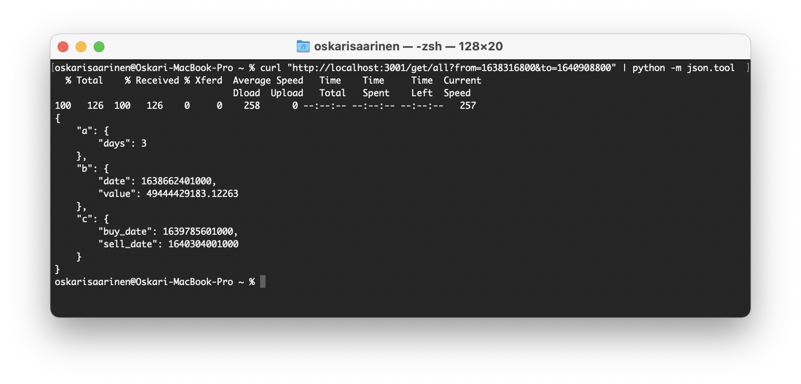
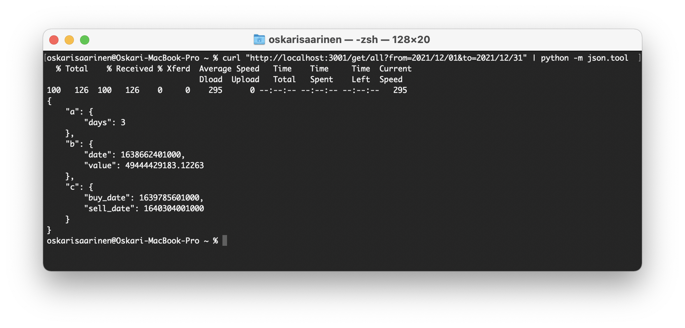
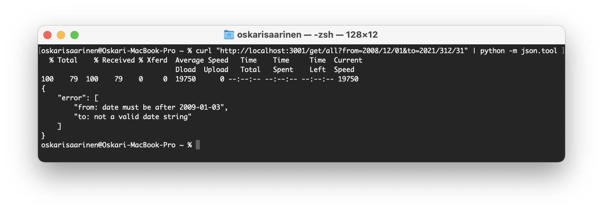
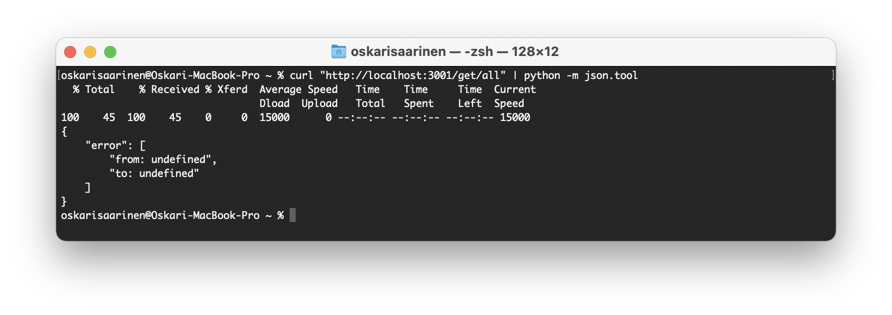
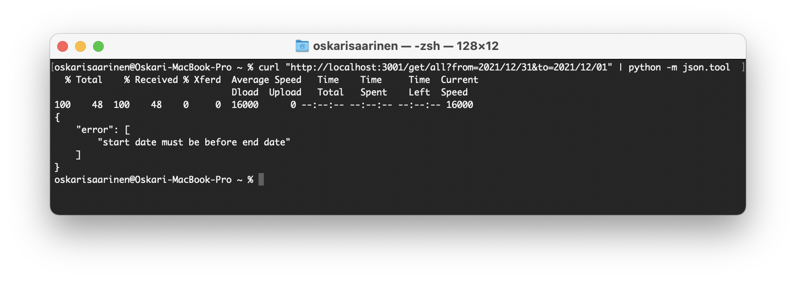

# Nodejs version

REST API made with `NodeJS` and `TypeScript`/`JavaScript`.

The source codes are well documented on code level.

## Using the API

The api is running at [Heroku](https://vincit-rising-star.herokuapp.com/) and can be used as follows:

* Assignment a) - `curl https://vincit-rising-star.herokuapp.com/get/a?from=start_date&to=end_date`
* Assignment b) - `curl https://vincit-rising-star.herokuapp.com/get/b?from=start_date&to=end_date`
* Assignment c) - `curl https://vincit-rising-star.herokuapp.com/get/c?from=start_date&to=end_date`
* Assignment All - `curl https://vincit-rising-star.herokuapp.com/get/all?from=start_date&to=end_date`

where

* `start_date`: start date of the range
* `end_date`: end date of the range

the date format can be in a `timestamp` (seconds since 1970) or in a date string: `yyyy-mm-dd` or `yyyy/mm/dd`.

So, for example to get range between 01-12-2021 and 31-12-2021, you can use:

* `timestamp`:  `curl "https://vincit-rising-star.herokuapp.com/get/all?from=1638316800&to=1640908800"`
* `yyyy-mm-dd`: `curl "https://vincit-rising-star.herokuapp.com/get/all?from=2021-12-01&to=2021-12-31"`
* `yyyy/mm/dd`: `curl "https://vincit-rising-star.herokuapp.com/get/all?from=2021/12/01&to=2021/12/31"`

You can convert other dates into timestamp in here: [https://www.unixtimestamp.com](https://www.unixtimestamp.com).

You can also give:

* `coin`: default is `bitcoin`
* `vs_currency`: default is `eur`

If you don't give the dates in correct format, then, instead of the data, you will receive a string array of error messages, whitch are (`name` is `from` or `to` - the incorrect date):

* `name: not a valid date string` - If you gave a date string in incorrect format
* `name: date must be after 2009-01-03` - If the date after Bitcoin's launch date (2009-01-03)
* `name: undefined` - If you didn't give the date
* `start date must be before end date` - If start date was after the end date

In order to run the app on your computer you will need `Nodejs`.

The app has some `TypeScript` files whitch needs to be converted into `JavaScript` with command `npx tsc`.

`npm start` will automatically run the convert command and starts the server with `npx tsc && node index.js`.

## Screenshots

