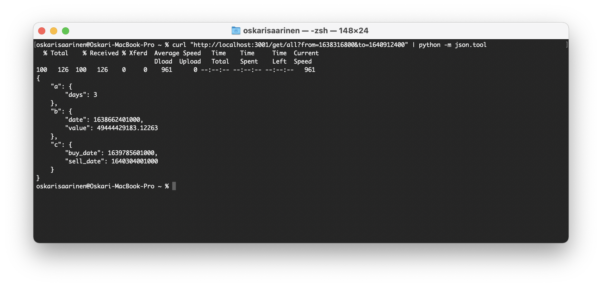

# Nodejs version

REST API made with `NodeJS` and `TypeScript`/`JavaScript`.

The source codes are well documented on code level.

## Using the API

The api is running at [Heroku](https://vincit-rising-star.herokuapp.com/) and can be used as follows:

* Assignment a) - `curl https://vincit-rising-star.herokuapp.com/get/a?from=start_date&to=end_date`
* Assignment b) - `curl https://vincit-rising-star.herokuapp.com/get/b?from=start_date&to=end_date`
* Assignment c) - `curl https://vincit-rising-star.herokuapp.com/get/c?from=start_date&to=end_date`
* Assignment All - `curl https://vincit-rising-star.herokuapp.com/get/all?from=start_date&to=end_date`

where

* `start_date`: start date of the range in seconds
* `end_date`: end date of the range in seconds

You can also give:

* `coin`: default is `bitcoin`
* `vs_currency`: default is `eur`

So, for example between 01-12-2021 and 31-12-2021 (add 1h (3600 seconds) to make sure the end date is included) would be `curl "https://vincit-rising-star.herokuapp.com/get/all?from=1638316800&to=1640912400"`.

You can convert other dates into timestamp in here: [https://www.unixtimestamp.com](https://www.unixtimestamp.com).

In order to run the app on your computer you will need `Nodejs`.

The app has some `TypeScript` files whitch needs to be converted into `JavaScript` with command `npx tsc`.

`npm start` will automatically run the convert command and starts the server with `npx tsc && node index.js`.

## Screenshots

