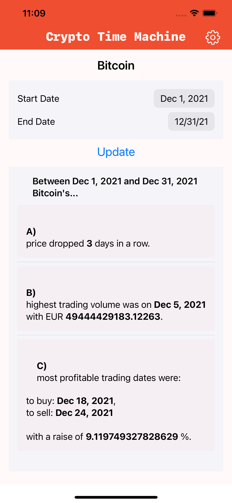
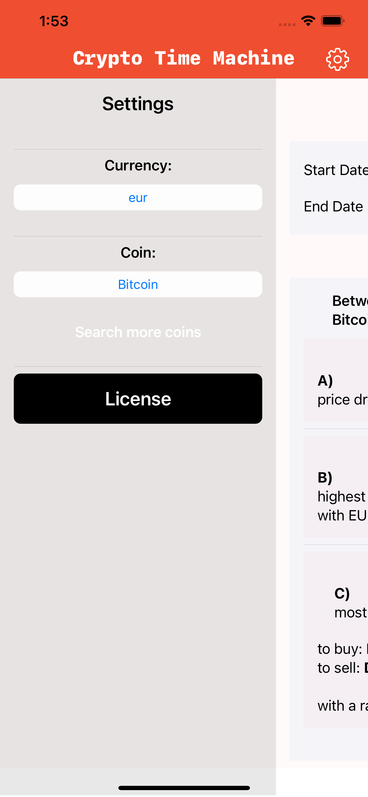
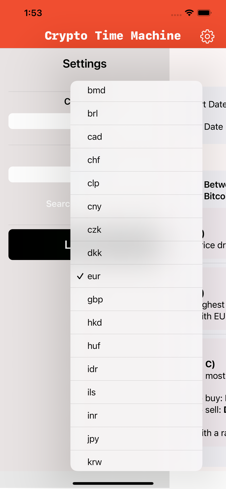
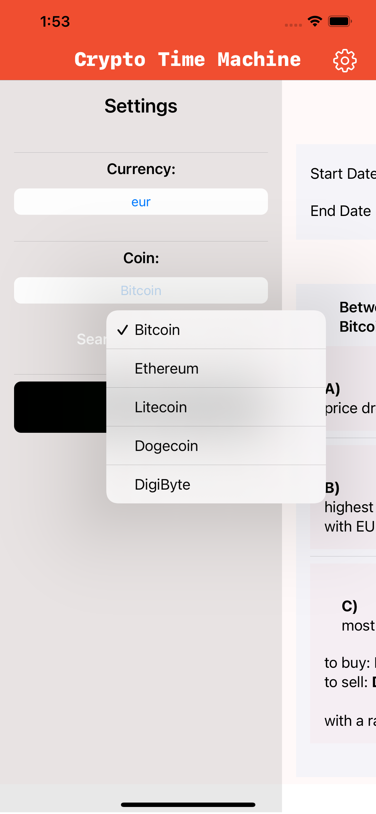
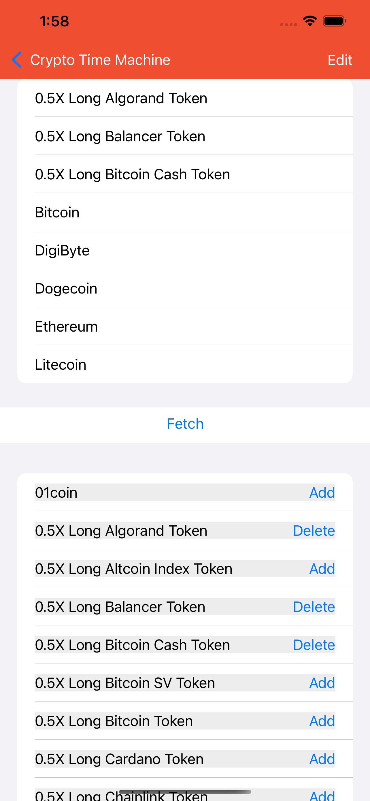

# Mobile - iOS version

Mobile app for iOS with `Swift` and `SwiftUI`.

It will be in the [AppStore](https://itunes.apple.com/us/developer/oskari-saarinen/id1234576917) after Apple has reviewed and approved it (takes usually 1-2 days).

The source codes are well documented on code level.

To run locally you need a Mac computer with Xcode IDE on it.

Open the `Vincit-Rising-Star-v1/Vincit-Rising-Star-v1.xcodeproj` in Xcode and change the team and signing certificates to your own and you can run it on simulator or on iPhone if you have one connected into your Mac.

 

## Screenshots

